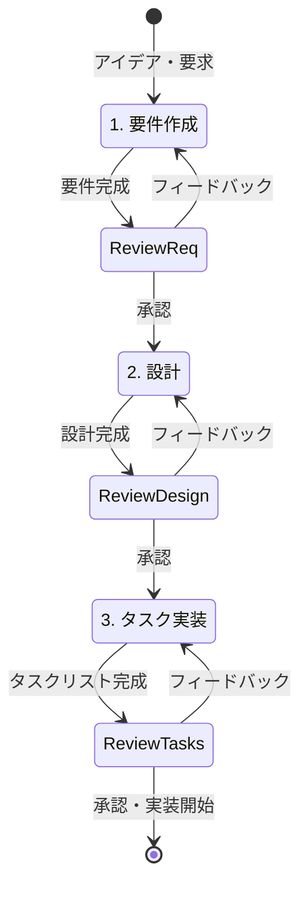

# Kiro解説

## Kiroとは

**Kiro**は、AI支援によるコーディングを効率化するための統合開発環境（IDE）です。従来の開発プロセスにAIの力を組み込み、開発者がより創造的で価値の高い作業に集中できるよう設計されています。

> 💡 **公式ドキュメント**: より詳細な情報は [kiro.dev/docs](https://kiro.dev/docs/) をご覧ください

### Kiroの特徴

- **AIコーディングのベストプラクティス**: 業界で実証されたAI活用手法を標準搭載
- **スペック駆動開発**: 要件から実装まで体系的なアプローチで複雑な機能を段階的に開発
- **直感的なユーザーインターフェース**: 学習コストを最小限に抑えた設計
- **柔軟な自律性モード**: AutopilotとSupervisedの2つのモードで開発スタイルを選択
- **強力なコンテキスト管理**: ファイル、フォルダ、問題、ターミナル、Git差分、コードベース全体を簡単に参照
- **拡張性**: MCPによる外部ツール連携とHooksによる自動化が可能

## なぜKiroを使うのか

### 従来の開発の課題

- 要件の曖昧さによる手戻り
- 設計とコードの乖離
- AIツールの断片的な利用
- チーム間での知識共有の困難

### Kiroが解決すること

- **体系的な開発プロセス**: 要件→設計→実装の一貫した流れ
- **AI支援の最適化**: 適切なタイミングでのAI活用
- **知識の蓄積と共有**: Steeringファイルによる組織知の活用
- **品質の向上**: 自動テストとレビューの統合

## Kiroの主要機能

### 1. Autonomy Modes（自律性モード）

Kiroは2つの動作モードを提供し、開発スタイルに応じて選択できます：

#### Autopilot（自動操縦）モード
- **特徴**: AIが自動的にファイルを修正し、変更を即座に適用
- **利点**: 高速な開発サイクル、反復作業の効率化
- **適用場面**: プロトタイピング、定型的な実装、信頼できるタスク
- **注意点**: 重要なファイルの変更前にはバックアップを推奨

#### Supervised（監督）モード
- **特徴**: 変更前に開発者が確認・承認してから適用
- **利点**: より慎重なアプローチ、学習機会の提供
- **適用場面**: 学習段階、重要な変更、本番環境のコード
- **推奨**: 初心者やKiroに慣れるまではこのモードを使用

> 💡 **使い分けのコツ**: 新しいプロジェクトや学習中はSupervisedモード、慣れてきたらAutopilotモードに切り替えると効率的です

### 2. Chat Context（チャットコンテキスト）

Kiroは強力なコンテキスト参照機能を提供し、AIに必要な情報を簡単に伝えられます：

#### 利用可能なコンテキスト

- **`#File`**: 特定のファイルを参照
  - 使用例: 「#File app.js を最適化して」
  - AIがファイル内容を読み込んで処理

- **`#Folder`**: フォルダ全体を参照
  - 使用例: 「#Folder src/ の構造を説明して」
  - フォルダ内のファイル一覧と構造を把握

- **`#Problems`**: 現在のエディタで検出されている問題を参照
  - 使用例: 「#Problems を修正して」
  - リント警告、型エラー、構文エラーなどを自動検出

- **`#Terminal`**: ターミナルの出力を参照
  - 使用例: 「#Terminal のエラーを解決して」
  - 実行結果やエラーメッセージを分析

- **`#Git Diff`**: 現在の変更差分を参照
  - 使用例: 「#Git Diff をレビューして」
  - コミット前の変更内容を確認・レビュー

- **`#Codebase`**: コードベース全体をインデックス化して検索
  - 使用例: 「#Codebase で認証機能を探して」
  - プロジェクト全体から関連コードを検索

> 💡 **活用のコツ**: コンテキストを組み合わせることで、より正確な指示が可能です。例：「#File config.js と #Problems を見て修正して」

### 3. Steering（ステアリング）

プロジェクト固有のルールや設計原則をAIに伝える仕組みです：

- **配置場所**: `.kiro/steering/*.md`
- **自動適用**: 常に含まれる、条件付き、手動の3つのモード
- **用途**: コーディング規約、設計原則、プロジェクト固有の知識
- **チーム共有**: リポジトリに含めてチーム全体で共有可能

**設定例**:
```markdown
---
inclusion: always
---

# プロジェクト設計原則

- TypeScriptの厳格モードを使用
- 関数は単一責任の原則に従う
- テストカバレッジは80%以上を維持
```

> 📖 **詳細**: Steeringの高度な使用方法は[第2章](../chapter2/steering-design-principles.md)で解説します

### 4. Spec（スペック）

複雑な機能を体系的に開発するための構造化されたワークフローです：

- **3段階のプロセス**: 要件定義 → 設計 → タスク実装
- **反復的な改善**: 各段階でレビューとフィードバックが可能
- **配置場所**: `.kiro/specs/{feature_name}/`
- **構成ファイル**: `requirements.md`、`design.md`、`tasks.md`

**Specsの利点**:
- 複雑な機能を段階的に開発できる
- 要件と実装の乖離を防ぐ
- チームでの認識合わせが容易
- 実装前に設計を検証できる

> 📖 **詳細**: Specsワークフローの詳細は[機能リファレンス](../features/specs-workflow.md)で解説します

### 5. Hooks（フック）

イベントトリガーによる自動化機能です：

- **イベント駆動**: ファイル保存、ボタンクリックなどをトリガーに実行
- **自動化例**: 
  - ファイル保存時にテストを自動実行
  - 翻訳ファイル更新時に他言語も自動更新
  - 手動トリガーでスペルチェック実行
- **設定方法**: エクスプローラーの「Agent Hooks」セクションまたはコマンドパレットから設定

**Hooksの活用例**:
```
保存時トリガー → テスト実行 → 結果通知
翻訳更新 → 他言語の翻訳も更新
手動実行 → READMEの文法チェック
```

> 📖 **詳細**: Hooksの完全ガイドは[機能リファレンス](../features/hooks-guide.md)で解説します

### 6. MCP（Model Context Protocol）

外部ツールやサービスとKiroを連携させる標準プロトコルです：

- **設定ファイル**: 
  - ワークスペースレベル: `.kiro/settings/mcp.json`
  - ユーザーレベル: `~/.kiro/settings/mcp.json`
- **実行方法**: `uvx`コマンドを使用（Pythonパッケージマネージャー`uv`が必要）
- **主要なMCPサーバー**:
  - AWS Documentation MCP: AWSドキュメントの参照
  - Playwright MCP: ブラウザ自動テスト
  - その他多数のコミュニティ製MCPサーバー

**MCP設定例**:
```json
{
  "mcpServers": {
    "aws-docs": {
      "command": "uvx",
      "args": ["awslabs.aws-documentation-mcp-server@latest"],
      "disabled": false,
      "autoApprove": []
    }
  }
}
```

> 💡 **テストのコツ**: MCP設定後は、設定ファイルを確認する前に直接ツールを試すのが推奨されます

> 📖 **詳細**: MCPの完全な設定ガイドは[第1章3節](playwright-mcp-testing.md)と[機能リファレンス](../features/mcp-configuration.md)で解説します

## スペック駆動開発の3段階

Kiroの核となるのは**スペック駆動開発（Spec-Driven Development）**です。これは複雑な機能を体系的に開発するための方法論で、以下の3段階で構成されます：



> 💡 **反復的なプロセス**: 各段階で必ずレビューとフィードバックのサイクルがあり、承認されるまで改善を繰り返します

### 第1段階: 要件作成（Requirements）

**目的**: 何を作るかを明確に定義する

**ファイル**: `.kiro/specs/{feature_name}/requirements.md`

#### 要件の構成要素

1. **ユーザーストーリー**: 「〜として、〜したい、なぜなら〜」形式
2. **受け入れ基準**: EARS形式（Easy Approach to Requirements Syntax）
   - `WHEN [イベント] THEN [システム] SHALL [応答]`
   - `IF [前提条件] THEN [システム] SHALL [応答]`
3. **制約条件**: 技術的・ビジネス的な制約の明記

#### 要件作成のプロセス

1. Kiroが初期要件を自動生成
2. ユーザーがレビュー・フィードバック
3. Kiroが修正・改善
4. **明示的な承認**を得るまで繰り返し
5. 承認後、設計段階へ進む

**例**:
```markdown
### Requirement 1

**User Story:** 
開発者として、コードレビューを自動化したい、なぜなら手動レビューは時間がかかるから

#### Acceptance Criteria

1. WHEN プルリクエストが作成された時 THEN システムは 自動的にコードレビューを開始する
2. WHEN レビューが完了した時 THEN システムは 結果をコメントで通知する
3. IF コードに問題が検出された時 THEN システムは 具体的な改善提案を提供する
```

> ⚠️ **重要**: 各段階で必ず明示的な承認（「はい」「承認」「良いです」など）が必要です。曖昧な返答では次の段階に進みません

### 第2段階: 設計（Design）

**目的**: どのように作るかを設計する

**ファイル**: `.kiro/specs/{feature_name}/design.md`

#### 設計の構成要素

1. **Overview（概要）**: 設計の全体像
2. **Architecture（アーキテクチャ）**: システム全体の構造
3. **Components and Interfaces（コンポーネントとインターフェース）**: 各部品の役割と関係
4. **Data Models（データモデル）**: 扱うデータの構造
5. **Error Handling（エラー処理）**: 例外処理の方針
6. **Testing Strategy（テスト戦略）**: テストの方針

#### 設計作成のプロセス

1. Kiroが要件に基づいて設計を作成
2. 必要に応じてコードベースを調査・研究
3. ユーザーがレビュー・フィードバック
4. Kiroが修正・改善
5. **明示的な承認**を得るまで繰り返し
6. 承認後、タスク分割段階へ進む

**重要なポイント**:
- 要件を満たす具体的な設計
- 実装可能な技術選択
- 拡張性と保守性の考慮
- 図解（Mermaidなど）の活用

### 第3段階: タスク分割・遂行（Tasks & Implementation）

**目的**: 実装可能な単位に分割して実行する

**ファイル**: `.kiro/specs/{feature_name}/tasks.md`

#### タスクリストの特徴

- **チェックボックス形式**: 進捗が一目で分かる
- **階層構造**: 最大2レベル（親タスクとサブタスク）
- **要件参照**: 各タスクが要件のどの部分を実装するか明記
- **オプションタスク**: `*`マークで任意のタスク（主にテスト）を示す

#### タスク作成のプロセス

1. Kiroが設計に基づいてタスクリストを作成
2. 各タスクは小さく実装可能な単位に分割
3. ユーザーがレビュー・フィードバック
4. Kiroが修正・改善
5. **明示的な承認**を得るまで繰り返し
6. 承認後、タスクを1つずつ実装開始

#### タスク実装の方法

- `tasks.md`ファイルを開く
- 各タスクの横にある「Start task」ボタンをクリック
- Kiroが1つのタスクを実装
- 完了後、次のタスクへ進む

**タスクの例**:
```markdown
- [ ] 1. プロジェクト構造の作成
  - ディレクトリ構造を設定
  - 基本的な設定ファイルを作成
  - _Requirements: 1.1, 1.2_

- [ ] 2. 基本的なAPIエンドポイントの実装
- [ ] 2.1 ルーティング設定
  - Express.jsのルーター設定
  - _Requirements: 2.1_
  
- [ ]* 2.2 ユニットテストの作成
  - APIエンドポイントのテスト
  - _Requirements: 2.1_
```

> 💡 **オプションタスク**: `*`マークのタスクは任意です。コア機能に集中したい場合はスキップできます #learn

## インストールと始め方

### 1. Kiroのダウンロード

[kiro.dev](https://kiro.dev)から最新版をダウンロードしてください。

### 2. 初期設定

1. Kiroを起動
2. プロジェクトフォルダを開く
3. 基本設定を確認

### 3. 最初のプロジェクト

1. 新しいフォルダを作成
2. Kiroでフォルダを開く
3. チャットで「Hello, Kiro!」と入力
4. AIとの対話を開始

## 学習のコツ

### 効果的な学習方法

1. **小さく始める**: 簡単なプロジェクトから開始
2. **実際に手を動かす**: 読むだけでなく実践する
3. **段階的に学習**: 基本機能から高度な機能へ
4. **コミュニティを活用**: 疑問は積極的に質問

### よくある初心者の間違い

- いきなり複雑なプロジェクトに挑戦する
- 要件を曖昧なまま設計に進む
- AIに全てを任せて学習しない
- エラーメッセージを読まない

## まとめ

Kiroは単なるAIコーディングツールではなく、開発プロセス全体を支援する統合環境です。スペック駆動開発を通じて、より確実で効率的な開発を実現できます。

次のセクションでは、実際にKiroを使ってテトリスゲームを作成し、具体的な開発プロセスを体験してみましょう。

---

## 📚 学習進捗チェック

このセクションを完了したら、以下の項目ができるようになっているか確認してください：

- [ ] Kiroの基本概念と目的を説明できる
- [ ] AutopilotとSupervisedモードの違いを理解し、使い分けられる
- [ ] Chat Contextの6つの機能（#File、#Folder、#Problems、#Terminal、#Git Diff、#Codebase）を説明できる
- [ ] スペック駆動開発の3段階（要件→設計→タスク）とレビュープロセスを理解している
- [ ] Steering、Hooks、MCPの基本的な役割を説明できる
- [ ] Kiroをインストールして基本操作ができる
- [ ] 公式ドキュメント（https://kiro.dev/docs/）の場所を知っている

---

<div align="center">

| [🏠 目次](../../README.md) | [🎮 テトリス作成 →](tetris-tutorial.md) |
|:---:|:---:|

</div>

---

### 🔗 関連リソース
- [📖 Kiro公式ドキュメント](https://kiro.dev/docs/) - 最新の機能と詳細情報
- [🔧 機能詳細リファレンス](../features/) - 各機能の詳細ガイド
- [🛠️ トラブルシューティング](../troubleshooting/common-issues.md)
- [❓ FAQ](../troubleshooting/faq.md)
- [📁 サンプルプロジェクト](../../examples/)