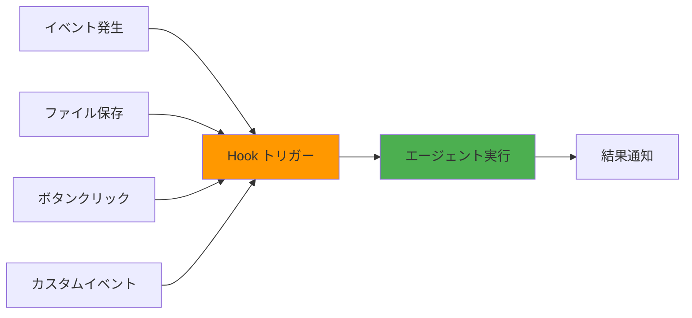

# Hooks完全ガイド

## 概要

**Kiro Hooks**は、特定のイベントが発生した際に自動的にエージェント実行を開始する機能です。ファイル保存時のテスト実行、翻訳ファイル更新時の他言語同期など、開発ワークフローを自動化できます。

## Hooksの基本概念

### Hooksとは

Hooksは、以下のようなイベントをトリガーとして、Kiroのエージェント実行を自動的に開始する仕組みです：

- **ファイル保存時**: コードを保存したタイミング
- **手動トリガー**: ボタンクリックやコマンド実行
- **その他のイベント**: プロジェクト固有のカスタムイベント

### 主な用途



**活用例：**
- ファイル保存時にテストを自動実行
- 翻訳ファイル更新時に他言語も自動更新
- 手動トリガーでREADMEのスペルチェック実行
- コミット前にコード品質チェック

## Hooksの設定方法

### 方法1: エクスプローラービューから設定

1. **Agent Hooksセクションを開く**
   - Kiroのエクスプローラービューで「Agent Hooks」セクションを探す
   - 既存のHooksが一覧表示される

2. **新しいHookを作成**
   - 「+」ボタンまたは「Create Hook」をクリック
   - Hook設定画面が開く

3. **Hook設定を入力**
   - Hook名
   - トリガー条件
   - 実行するプロンプト
   - 対象ファイルパターン

### 方法2: コマンドパレットから設定

1. **コマンドパレットを開く**
   - macOS: `Cmd + Shift + P`
   - Windows/Linux: `Ctrl + Shift + P`

2. **「Open Kiro Hook UI」を検索**
   - コマンドパレットに「MCP」または「Hook」と入力
   - 「Open Kiro Hook UI」を選択

3. **Hook UIで設定**
   - ビジュアルインターフェースでHookを設定

## Hook設定の詳細

### 基本設定項目

```yaml
# Hook設定の例
name: "Run Tests on Save"
trigger: "onSave"
filePattern: "src/**/*.{ts,tsx}"
prompt: |
  変更されたファイルに関連するテストを実行してください。
  
  実行手順:
  1. 変更されたファイルを特定
  2. 関連するテストファイルを検索
  3. テストを実行
  4. 結果をサマリー表示
enabled: true
```

### トリガータイプ

#### 1. onSave（ファイル保存時）

```yaml
name: "Auto Test on Save"
trigger: "onSave"
filePattern: "src/**/*.ts"
prompt: |
  保存されたファイルのテストを実行してください。
```

**使用例：**
- ユニットテストの自動実行
- リントチェック
- 型チェック
- フォーマット確認

#### 2. manual（手動トリガー）

```yaml
name: "Spell Check README"
trigger: "manual"
filePattern: "README.md"
prompt: |
  README.mdのスペルチェックと文法チェックを実行してください。
  
  確認項目:
  - スペルミス
  - 文法エラー
  - リンク切れ
  - フォーマットの一貫性
```

**使用例：**
- ドキュメントのレビュー
- コード品質の総合チェック
- デプロイ前の最終確認
- パフォーマンス分析

#### 3. custom（カスタムイベント）

カスタムイベントは、プロジェクト固有のワークフローや複雑な条件に基づいてHookを実行する仕組みです。

```yaml
name: "Update Translations"
trigger: "custom"
event: "translationUpdate"
filePattern: "locales/en/**/*.json"
prompt: |
  英語の翻訳ファイルが更新されました。
  他の言語の翻訳ファイルも更新してください。
  
  対象言語: ja, zh, ko, fr, de
```

**使用例：**
- 特定のビジネスロジックに基づくトリガー
- 複数の条件を組み合わせた実行
- 外部システムとの連携
- ワークフロー内の特定ステップ

**カスタムイベントの実行方法：**

カスタムイベントは以下の方法で発火させることができます：

1. **コマンドパレットから実行**
   ```
   Cmd/Ctrl + Shift + P → "Kiro: Trigger Custom Hook Event"
   → イベント名を選択または入力
   ```

2. **プログラムから実行（拡張機能API）**
   ```typescript
   // Kiro拡張機能内から
   await vscode.commands.executeCommand(
     'kiro.triggerCustomEvent',
     'translationUpdate'
   );
   ```

3. **他のHookから連鎖実行**
   ```yaml
   name: "Translation File Saved"
   trigger: "onSave"
   filePattern: "locales/en/**/*.json"
   prompt: |
     翻訳ファイルが保存されました。
     カスタムイベント 'translationUpdate' をトリガーします。
   actions:
     - triggerEvent: "translationUpdate"
   ```

4. **外部スクリプトから実行**
   ```bash
   # Kiro CLIを使用（将来的な機能）
   kiro hook trigger translationUpdate
   ```

**カスタムイベントの設定例：**

```yaml
# 例1: デプロイ準備チェック
name: "Pre-deployment Check"
trigger: "custom"
event: "beforeDeploy"
filePattern: "**/*"
prompt: |
  #Codebase
  #Problems
  
  デプロイ前の最終チェックを実行します：
  
  1. 全テストが通過しているか
  2. ビルドエラーがないか
  3. 環境変数が設定されているか
  4. セキュリティ脆弱性がないか
  5. パフォーマンス基準を満たしているか
enabled: true

# 例2: データベースマイグレーション後
name: "Post-migration Validation"
trigger: "custom"
event: "afterMigration"
filePattern: "prisma/schema.prisma"
prompt: |
  #File prisma/schema.prisma
  
  マイグレーション後の検証を実行します：
  
  1. スキーマの整合性確認
  2. シードデータの投入確認
  3. 関連するTypeScript型定義の更新
  4. APIエンドポイントの互換性確認
enabled: true

# 例3: 複数ファイル変更の統合処理
name: "Batch File Processing"
trigger: "custom"
event: "batchUpdate"
filePattern: "src/**/*.{ts,tsx}"
prompt: |
  複数ファイルの一括更新が完了しました。
  
  統合処理を実行します：
  1. 依存関係の再解析
  2. 型チェックの実行
  3. インポート文の最適化
  4. 未使用コードの検出
enabled: true

# 例4: 外部API連携
name: "Sync with External System"
trigger: "custom"
event: "externalSync"
filePattern: "**/*"
prompt: |
  外部システムとの同期イベントが発生しました。
  
  同期処理：
  1. 変更内容の取得
  2. ローカルファイルの更新
  3. コンフリクトの検出と解決
  4. 同期ログの記録
enabled: true
```

### トリガー条件の詳細比較

| トリガータイプ | 発火タイミング | 実行頻度 | 主な用途 | パフォーマンス影響 |
|--------------|--------------|---------|---------|------------------|
| **onSave** | ファイル保存時 | 保存毎 | リアルタイム検証 | 中〜高（throttle推奨） |
| **manual** | ユーザー操作時 | 任意 | 重い処理・レビュー | 低（必要時のみ） |
| **custom** | カスタムイベント | イベント発生時 | 複雑なワークフロー | 低〜中（設計次第） |

### ファイルパターン

```yaml
# 特定のディレクトリ
filePattern: "src/components/**/*.tsx"

# 複数の拡張子
filePattern: "src/**/*.{ts,tsx,js,jsx}"

# 特定のファイル名
filePattern: "**/package.json"

# 除外パターン
filePattern: "src/**/*.ts"
excludePattern: "**/*.test.ts"

# ルートディレクトリのファイル
filePattern: "*.md"
```

### ファイルパターンの詳細解説

#### Globパターンの基本構文

```yaml
# ワイルドカード
*        # 任意の文字列（ディレクトリ区切りを除く）
**       # 任意の階層のディレクトリ
?        # 任意の1文字
[abc]    # a, b, c のいずれか
{a,b}    # a または b

# 実例
"*.ts"                    # ルートの全TSファイル
"src/*.ts"                # srcディレクトリ直下の全TSファイル
"src/**/*.ts"             # src以下の全TSファイル（再帰的）
"src/**/test/*.ts"        # src以下のtestディレクトリ内の全TSファイル
"**/*.{ts,tsx}"           # 全階層の.tsと.tsxファイル
"src/[a-z]*.ts"           # srcディレクトリの小文字で始まるTSファイル
```

#### 実践的なパターン例

```yaml
# 1. コンポーネントファイルのみ（Storybookを除外）
filePattern: "src/components/**/*.tsx"
excludePattern: "**/*.stories.tsx"

# 2. 設定ファイル群
filePattern: "{package.json,tsconfig.json,*.config.{js,ts}}"

# 3. テストファイル以外のTypeScript
filePattern: "src/**/*.{ts,tsx}"
excludePattern: "**/*.{test,spec}.{ts,tsx}"

# 4. 特定の命名規則に従うファイル
filePattern: "src/**/*Controller.ts"
filePattern: "src/**/*Service.ts"
filePattern: "src/**/*Repository.ts"

# 5. 複数ディレクトリの同じ拡張子
filePattern: "{src,lib,packages}/**/*.ts"

# 6. ドキュメントファイル（複数形式）
filePattern: "docs/**/*.{md,mdx,txt}"

# 7. APIルートファイル
filePattern: "src/api/**/route.ts"
filePattern: "pages/api/**/*.{ts,tsx}"
```

## 実践的なHook例

### 例1: テスト自動実行Hook

```yaml
name: "Auto Run Tests"
trigger: "onSave"
filePattern: "src/**/*.{ts,tsx}"
excludePattern: "**/*.test.{ts,tsx}"
prompt: |
  #File {savedFile}
  
  このファイルに関連するテストを実行してください。
  
  手順:
  1. 対応するテストファイルを探す
  2. テストを実行
  3. 失敗したテストがあれば詳細を表示
  4. カバレッジ情報を表示
  
  テストコマンド: npm test -- {testFile}
enabled: true
```

**動作:**
1. `src/utils/validator.ts`を保存
2. Hookが自動的にトリガー
3. `src/utils/validator.test.ts`を実行
4. 結果を通知

### 例2: 翻訳同期Hook

```yaml
name: "Sync Translations"
trigger: "onSave"
filePattern: "locales/en/**/*.json"
prompt: |
  #File {savedFile}
  
  英語の翻訳ファイルが更新されました。
  他の言語の翻訳ファイルも同期してください。
  
  対象言語:
  - 日本語 (ja)
  - 中国語 (zh)
  - 韓国語 (ko)
  
  手順:
  1. 変更されたキーを特定
  2. 各言語の対応するファイルを更新
  3. 翻訳が必要な新しいキーをマーク
  4. 変更サマリーを表示
enabled: true
```

### 例3: コード品質チェックHook

```yaml
name: "Code Quality Check"
trigger: "manual"
filePattern: "src/**/*.{ts,tsx}"
prompt: |
  #Folder src/
  #Problems
  
  コード品質の総合チェックを実行してください。
  
  チェック項目:
  1. ESLint警告の確認
  2. TypeScript型エラーの確認
  3. 複雑度の高い関数の特定
  4. 重複コードの検出
  5. セキュリティ脆弱性のスキャン
  
  各項目について:
  - 問題の数
  - 重要度
  - 修正提案
  
  を報告してください。
enabled: true
```

### 例4: ドキュメント更新Hook

```yaml
name: "Update API Docs"
trigger: "onSave"
filePattern: "src/api/**/*.ts"
prompt: |
  #File {savedFile}
  
  APIエンドポイントが変更されました。
  ドキュメントを更新してください。
  
  更新対象:
  1. docs/api/endpoints.md
  2. openapi.yaml
  3. README.md (必要に応じて)
  
  手順:
  1. 変更されたエンドポイントを特定
  2. ドキュメントの該当箇所を更新
  3. 例示コードを更新
  4. 変更履歴に記録
enabled: true
```

### 例5: Git コミット前チェックHook

```yaml
name: "Pre-commit Check"
trigger: "manual"
filePattern: "**/*"
prompt: |
  #Git Diff
  
  コミット前の最終チェックを実行してください。
  
  チェック項目:
  1. 全てのテストが通過しているか
  2. リント警告がないか
  3. コンソールログが残っていないか
  4. TODOコメントが追加されていないか
  5. 機密情報が含まれていないか
  
  問題があれば詳細を報告し、
  問題なければコミットメッセージの提案をしてください。
enabled: true
```

## Hook実行の制御

### 有効/無効の切り替え

```yaml
# Hookを無効化
enabled: false

# Hookを有効化
enabled: true
```

### 条件付き実行

```yaml
name: "Conditional Test"
trigger: "onSave"
filePattern: "src/**/*.ts"
prompt: |
  #File {savedFile}
  
  IF ファイルサイズが100行以上 THEN
    完全なテストスイートを実行
  ELSE
    クイックテストのみ実行
  END IF
enabled: true
```

### 実行頻度の制限

```yaml
name: "Rate Limited Hook"
trigger: "onSave"
filePattern: "src/**/*.ts"
throttle: 5000  # 5秒間に1回まで
prompt: |
  テストを実行してください。
enabled: true
```

## Hook変数の活用

### 利用可能な変数

```yaml
prompt: |
  # ファイル関連
  {savedFile}      # 保存されたファイルのパス
  {fileName}       # ファイル名のみ
  {fileDir}        # ファイルのディレクトリ
  {fileExt}        # ファイルの拡張子
  
  # プロジェクト関連
  {workspaceRoot}  # ワークスペースのルートパス
  {projectName}    # プロジェクト名
  
  # Git関連
  {gitBranch}      # 現在のブランチ名
  {gitCommit}      # 最新のコミットハッシュ
  
  # 時刻関連
  {timestamp}      # 現在のタイムスタンプ
  {date}           # 現在の日付
```

### 変数の使用例

```yaml
name: "Smart Test Runner"
trigger: "onSave"
filePattern: "src/**/*.ts"
prompt: |
  保存されたファイル: {savedFile}
  ファイル名: {fileName}
  ディレクトリ: {fileDir}
  
  #File {savedFile}
  
  このファイルのテストを実行してください。
  テストファイル: {fileDir}/{fileName}.test.ts
enabled: true
```

## トラブルシューティング

### 問題1: Hookが実行されない

**確認項目:**

```yaml
# 1. enabledがtrueか確認
enabled: true

# 2. filePatternが正しいか確認
filePattern: "src/**/*.ts"  # 正しい
filePattern: src/**/*.ts    # 間違い（クォートが必要）

# 3. トリガー条件が適切か確認
trigger: "onSave"  # ファイル保存時
trigger: "manual"  # 手動実行のみ
```

**デバッグ方法:**

```yaml
name: "Debug Hook"
trigger: "onSave"
filePattern: "**/*"  # 全てのファイルで試す
prompt: |
  Hook が実行されました！
  
  ファイル: {savedFile}
  時刻: {timestamp}
enabled: true
```

### 問題2: Hook実行が遅い

**原因と対策:**

```yaml
# 原因1: プロンプトが複雑すぎる
# 対策: プロンプトを簡潔にする

# 原因2: 対象ファイルが多すぎる
# 対策: filePatternを限定する
filePattern: "src/components/**/*.tsx"  # 限定的
# filePattern: "**/*"  # 広すぎる

# 原因3: 頻繁に実行されすぎる
# 対策: throttleを設定
throttle: 3000  # 3秒間に1回まで
```

### 問題3: Hook実行結果が期待と異なる

**デバッグプロンプト:**

```yaml
name: "Debug Execution"
trigger: "onSave"
filePattern: "src/**/*.ts"
prompt: |
  デバッグ情報を表示してください:
  
  1. 保存されたファイル: {savedFile}
  2. ファイル内容の最初の10行
  3. 関連するテストファイルの有無
  4. 現在のGitブランチ: {gitBranch}
  5. ワークスペースルート: {workspaceRoot}
enabled: true
```

## ベストプラクティス

### 1. 明確な命名

```yaml
# 良い例
name: "Run Unit Tests on Save"
name: "Update Translation Files"
name: "Pre-commit Quality Check"

# 悪い例
name: "Hook1"
name: "Test"
name: "Do Something"
```

### 2. 具体的なプロンプト

```yaml
# 良い例
prompt: |
  #File {savedFile}
  
  このファイルのユニットテストを実行してください。
  
  手順:
  1. 対応するテストファイルを探す
  2. npm test -- {testFile} を実行
  3. 結果をサマリー表示
  4. 失敗があれば詳細を表示

# 悪い例
prompt: "テストして"
```

### 3. 適切なスコープ

```yaml
# 良い例: 特定のディレクトリに限定
filePattern: "src/components/**/*.tsx"

# 悪い例: 範囲が広すぎる
filePattern: "**/*"
```

### 4. エラーハンドリング

```yaml
prompt: |
  #File {savedFile}
  
  テストを実行してください。
  
  エラーハンドリング:
  - テストファイルが見つからない場合: 警告を表示
  - テストが失敗した場合: 詳細なエラー情報を表示
  - タイムアウトした場合: 実行を中断して通知
```

## 高度な活用例

### チーム開発での活用

```yaml
# .kiro/hooks/team-hooks.yml
hooks:
  - name: "Code Review Helper"
    trigger: "manual"
    filePattern: "**/*"
    prompt: |
      #Git Diff
      
      コードレビューの準備をしてください:
      
      1. 変更サマリーの作成
      2. 潜在的な問題の指摘
      3. テストカバレッジの確認
      4. ドキュメント更新の必要性チェック
      5. PRテンプレートの生成
    enabled: true
  
  - name: "Onboarding Helper"
    trigger: "manual"
    filePattern: "**/*"
    prompt: |
      #Codebase
      
      新メンバー向けのプロジェクト説明を生成してください:
      
      1. プロジェクト構造の説明
      2. 主要なコンポーネントの解説
      3. 開発環境のセットアップ手順
      4. よく使うコマンドの一覧
      5. コーディング規約のサマリー
    enabled: true
```

## まとめ

Kiro Hooksの効果的な活用により：

1. **開発効率の向上**: 反復作業の自動化
2. **品質の保証**: 自動テストとチェック
3. **一貫性の維持**: 標準化されたワークフロー
4. **チーム協働の促進**: 共通のHooks設定

> 💡 **推奨アプローチ**: シンプルなHookから始めて、徐々に高度な自動化を追加していくことをお勧めします。

> 📖 **公式ドキュメント**: 最新の機能と詳細については [kiro.dev/docs](https://kiro.dev/docs/) を参照してください

---

## 📚 関連リソース

- [🏠 目次](../../README.md)
- [📖 Kiro基礎解説](../chapter1/kiro-introduction.md)
- [💻 実装・テスト・自動化](../chapter2/implementation-testing.md)
- [🛠️ トラブルシューティング](../troubleshooting/common-issues.md)
